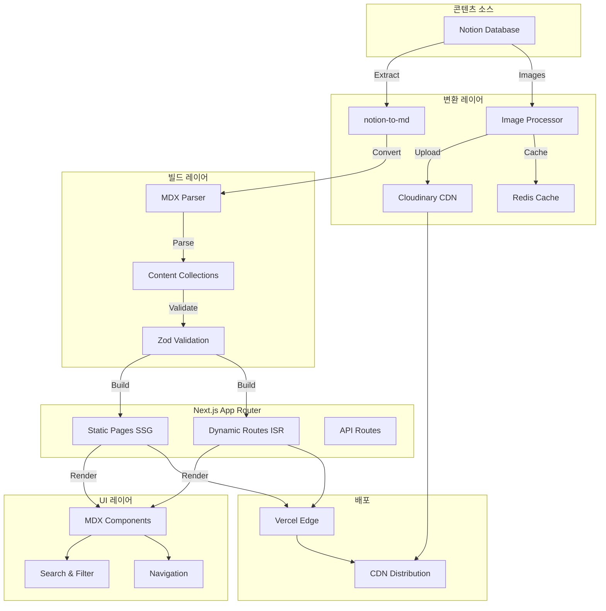

# 아키텍처

이 문서는 Norkive의 시스템 아키텍처, 설계 결정, 기술적 구현에 대해 설명합니다.

## 목차

- [시스템 개요](#시스템-개요)
- [데이터 플로우](#데이터-플로우)
- [핵심 컴포넌트](#핵심-컴포넌트)
- [설계 결정](#설계-결정)
- [캐싱 전략](#캐싱-전략)
- [번들 최적화](#번들-최적화)

---

## 시스템 개요

Norkive는 빌드 타임 콘텐츠 변환 파이프라인을 통해 성능, SEO, 개발자 경험을 우선시하는 **정적 우선 아키텍처**를 따릅니다.

```
Notion Database → MDX 변환 → 타입 안전 Content Collections → Next.js 정적 사이트 → Vercel Edge
```

### 아키텍처 원칙

1. **런타임보다 빌드 타임**: 복잡성을 빌드 타임으로 이동하여 런타임 의존성 최소화
2. **타입 안전성 우선**: 컴파일 타임 및 런타임 검증을 위한 Zod 스키마 + TypeScript
3. **기본 성능**: 1초 미만 로딩을 위한 정적 생성 + Edge CDN
4. **개발자 경험**: 자동 완성, 타입 추론, 빠른 피드백 루프

---

## 데이터 플로우



### 변환 파이프라인

#### 1. 콘텐츠 추출

```typescript
// scripts/notion-mdx-all-in-one.ts
async function extractFromNotion(databaseId: string) {
  // Notion 데이터베이스 쿼리
  const pages = await notion.databases.query({ database_id: databaseId });
  
  // 페이지 콘텐츠 추출
  for (const page of pages.results) {
    const blocks = await notion.blocks.children.list({ block_id: page.id });
    const content = await n2m.pageToMarkdown(page.id);
    
    // 이미지 처리
    const processedContent = await processImages(content);
    
    // Frontmatter 생성
    const frontmatter = generateFrontmatter(page.properties);
    
    // MDX로 저장
    await saveMDX(frontmatter, processedContent);
  }
}
```

#### 2. 타입 안전 스키마

```typescript
// content-collections.ts
const recordSchema = z.object({
  notionId: z.string(),
  title: z.string(),
  date: z.coerce.date(),
  category: z.string().optional(),
  tags: z.array(z.string()).optional(),
  draft: z.boolean().default(false),
  favorite: z.boolean().default(false),
  // ... 검증이 포함된 20개 이상의 필드
});

const records = defineCollection({
  name: 'records',
  directory: 'content/records',
  schema: recordSchema,
  transform: transformMDX, // Fumadocs 변환
});
```

#### 3. 정적 생성

```typescript
// app/records/[...slug]/page.tsx
export async function generateStaticParams() {
  return allRecords.map((post) => ({
    slug: post._meta.path.split('/'),
  }));
}

export const revalidate = 3600; // ISR: 1시간
```

---

## 핵심 컴포넌트

### 1. Fumadocs + Content Collections 통합

**Fumadocs**는 문서화 시스템과 MDX 플러그인을 제공하고, **Content Collections**는 타입 안전 콘텐츠 인덱싱을 처리합니다.

```typescript
// 자동 생성된 타입 안전 컬렉션
import { allRecords } from '.content-collections/generated';

// 완전한 IntelliSense와 함께 타입 안전 쿼리
const engineeringPosts = allRecords
  .filter(r => r.category === 'Engineering')
  .sort((a, b) => b.date.getTime() - a.date.getTime());
```

**장점**:
- 컴파일 타임 + 런타임 타입 검사
- IDE에서 자동 완성
- 스키마 위반 시 빌드 실패
- 런타임 오버헤드 제로

### 2. 이미지 최적화 파이프라인

#### 문제: Notion S3 URL은 1시간 후 만료됨

#### 해결책: Cloudinary + Redis 캐싱

```typescript
async function processImage(notionUrl: string) {
  // Redis 캐시 확인
  const cached = await redis.get(`img:${md5(notionUrl)}`);
  if (cached) return cached;
  
  // Cloudinary에 업로드
  const result = await cloudinary.uploader.upload(notionUrl, {
    folder: 'norkive-images',
    transformation: [
      { width: 1200, crop: 'limit' },
      { quality: 'auto' },
      { fetch_format: 'auto' }, // 자동 WebP/AVIF
    ],
  });
  
  // 매핑 캐시
  await redis.set(`img:${md5(notionUrl)}`, result.secure_url, 'EX', 86400);
  
  return result.secure_url;
}
```

**결과**:
- 평균 70% 이미지 크기 감소
- 3배 빠른 로딩 (CDN + 현대적 포맷)
- 영구 URL (만료 없음)

### 3. MDX 컴포넌트 시스템

```typescript
// getMDXComponents.tsx
export function getMDXComponents(components?: MDXComponents): MDXComponents {
  return {
    // Shiki 문법 강조가 있는 코드 블록
    pre: (props) => <CodeBlock {...props} />,
    
    // 커스텀 Callout
    Callout: ({ type, children }) => (
      <div className={`callout-${type}`}>{children}</div>
    ),
    
    // 최적화된 이미지
    img: (props) => (
      <Image {...props} loading="lazy" placeholder="blur" />
    ),
    
    // 향상된 테이블
    table: (props) => <Table {...props} />,
    
    ...components,
  };
}
```

---

## 설계 결정

### 1. 왜 서버 사이드 렌더링 대신 정적 생성인가?

| 측면 | SSR | SSG | 결정 |
|--------|-----|-----|----------|
| **성능** | ~500ms TTFB | <200ms TTFB | ✅ SSG |
| **SEO** | 좋음 | 탁월함 | ✅ SSG |
| **서버 비용** | 높음 | 없음 | ✅ SSG |
| **실시간 업데이트** | 예 | 아니오 (ISR: 1시간) | ⚠️ 수용 가능 |

**결론**: 업데이트가 드문 콘텐츠 중심 사이트의 경우 SSG + ISR이 더 나은 성능과 낮은 비용을 제공합니다.

### 2. 왜 CMS(Contentful/Strapi) 대신 MDX인가?

| 요소 | CMS | MDX | 우승자 |
|--------|-----|-----|--------|
| **타입 안전성** | API 타입 | Zod 스키마 | 🏆 MDX |
| **성능** | API 지연 | 빌드 타임 | 🏆 MDX |
| **비용** | $29+/월 | 무료 | 🏆 MDX |
| **유연성** | 제한적 | 완전한 제어 | 🏆 MDX |
| **학습 곡선** | 높음 | 중간 | 🏆 MDX |

### 3. 왜 Next.js Image Optimization 대신 Cloudinary인가?

**Next.js Image Optimization**:
- ❌ 런타임 계산 필요 (Vercel 요금)
- ❌ 자동 포맷 변환 없음
- ❌ 제한된 변환 옵션

**Cloudinary**:
- ✅ 무료 티어: 25GB 스토리지, 25GB 대역폭
- ✅ 자동 WebP/AVIF 변환
- ✅ 고급 변환 (자르기, 리사이즈, 효과)
- ✅ 글로벌 CDN

### 4. 왜 파일 시스템 대신 Content Collections인가?

**파일 시스템 접근법**:
```typescript
// 수동 파일 읽기
const files = fs.readdirSync('content/records');
const posts = files.map(file => {
  const content = fs.readFileSync(file);
  const { data, content: body } = matter(content);
  return { ...data, body }; // 타입 안전성 없음!
});
```

**Content Collections**:
```typescript
// 타입 안전, 자동 생성
import { allRecords } from '.content-collections/generated';

allRecords.forEach(post => {
  console.log(post.title); // ✅ TypeScript가 이것이 존재함을 알고 있음
  console.log(post.dat);   // ❌ 컴파일 오류: 'date'를 의미했나요?
});
```

---

## 캐싱 전략

### 3계층 캐싱 아키텍처

```typescript
// Level 1: 메모리 캐시 (빌드 타임)
const memoryCache = new Map();

// Level 2: Redis 캐시 (공유, 영구)
const redis = new Redis(process.env.UPSTASH_REDIS_REST_URL);

// Level 3: 정적 생성 (CDN)
export const revalidate = 3600;
```

#### 캐시 계층

```
요청
  ↓
1. Vercel Edge CDN (글로벌, 즉시)
  ↓ (캐시 미스)
2. 정적 페이지 (로컬, <10ms)
  ↓ (ISR 필요)
3. Redis 캐시 (원격, <50ms)
  ↓ (캐시 미스)
4. MDX에서 재빌드 (로컬, <100ms)
```

### 캐시 무효화

```typescript
// API를 통한 수동 재검증
export async function POST(request: Request) {
  const { slug } = await request.json();
  
  // 특정 경로 재검증
  revalidatePath(`/records/${slug}`);
  
  // Redis 캐시 지우기
  await redis.del(`page:${slug}`);
  
  return Response.json({ revalidated: true });
}
```

---

## 번들 최적화

### 코드 분할 전략

```javascript
// next.config.ts
webpack: (config) => ({
  ...config,
  optimization: {
    splitChunks: {
      chunks: 'all',
      cacheGroups: {
        // 벤더 라이브러리 (420KB)
        vendor: {
          test: /node_modules/,
          name: 'vendors',
          priority: 10,
        },
        // Radix UI 컴포넌트 (150KB)
        radix: {
          test: /@radix-ui/,
          name: 'radix-ui',
          priority: 9,
        },
        // MDX 콘텐츠 (180KB)
        mdx: {
          test: /content/,
          name: 'mdx-content',
          priority: 8,
        },
        // 공통 컴포넌트 (140KB)
        common: {
          minChunks: 2,
          name: 'common',
          priority: 5,
        },
      },
    },
  },
}),
```

### Tree Shaking

```typescript
// next.config.ts
experimental: {
  optimizePackageImports: [
    'lucide-react',        // 사용된 아이콘만 가져오기
    '@radix-ui/react-icons',
    '@fortawesome/fontawesome-svg-core',
  ],
},
```

### 결과

```
최적화 전: 2.3MB
최적화 후: 890KB (61% 감소)

분류:
  vendors.js:   420KB (47%)
  mdx-content:  180KB (20%)
  radix-ui:     150KB (17%)
  common:       140KB (16%)
```

---

## 성능 메트릭

### 빌드 성능

```
지표                  시간
────────────────────────────
MDX 파싱             12초
Content Collections   8초
정적 생성            15초
Webpack 빌드         10초
────────────────────────────
총 빌드 시간         45초
```

**최적화 기법**:
- 병렬 처리: 3분 → 1분 20초
- 증분 빌드: 1분 20초 → 45초

### 런타임 성능

```
지표              점수     목표    상태
─────────────────────────────────────────
LCP              1.2s     <2.5s   ✅
FID              12ms     <100ms  ✅
CLS              0.02     <0.1    ✅
TTFB             180ms    <600ms  ✅
```

---

## 보안 고려사항

### 콘텐츠 보안 정책

```typescript
// next.config.ts
async headers() {
  return [
    {
      source: '/:path*',
      headers: [
        {
          key: 'Content-Security-Policy',
          value: `
            default-src 'self';
            script-src 'self' 'unsafe-eval' 'unsafe-inline';
            style-src 'self' 'unsafe-inline';
            img-src 'self' data: https://res.cloudinary.com;
            font-src 'self' data:;
          `.replace(/\s{2,}/g, ' ').trim()
        },
      ],
    },
  ];
},
```

### 환경 변수

- `.env.local`을 절대 버전 관리에 커밋하지 않기
- 프로덕션에는 Vercel 환경 변수 사용
- API 키 정기적으로 교체
- 읽기 전용 Notion 통합 토큰 사용

---

## 모니터링 & 관찰성

### Vercel Analytics

```typescript
// app/layout.tsx
import { Analytics } from '@vercel/analytics/react';

export default function RootLayout({ children }) {
  return (
    <html>
      <body>
        {children}
        <Analytics />
      </body>
    </html>
  );
}
```

### 오류 추적

```typescript
// app/error.tsx
'use client';

export default function Error({ error, reset }) {
  useEffect(() => {
    // 오류 추적 서비스에 로그
    console.error('Error:', error);
  }, [error]);

  return (
    <div>
      <h2>문제가 발생했습니다!</h2>
      <button onClick={reset}>다시 시도</button>
    </div>
  );
}
```

---

## 향후 고려사항

### 잠재적 개선 사항

1. **Edge Functions**: 이미지 처리를 Vercel Edge로 이동
2. **Incremental Static Regeneration**: 재검증 시간을 5분으로 단축
3. **Partial Hydration**: React Server Components를 더 광범위하게 사용
4. **Service Worker**: 오프라인 지원 및 백그라운드 동기화

### 확장성

현재 아키텍처 지원:
- ✅ 1,000+ MDX 파일
- ✅ 10,000+ 이미지 (Cloudinary)
- ✅ 100,000+ 월간 방문자 (Vercel 무료 티어)

더 큰 규모를 위해:
- 전용 이미지 CDN 고려
- 전문 검색 구현 (Algolia/Typesense)
- 분석을 위한 데이터베이스 추가

---

## 참고 자료

- [Next.js App Router 문서](https://nextjs.org/docs/app)
- [Content Collections 문서](https://www.content-collections.dev/)
- [Fumadocs 문서](https://fumadocs.vercel.app/)
- [Cloudinary 변환 가이드](https://cloudinary.com/documentation/image_transformations)

