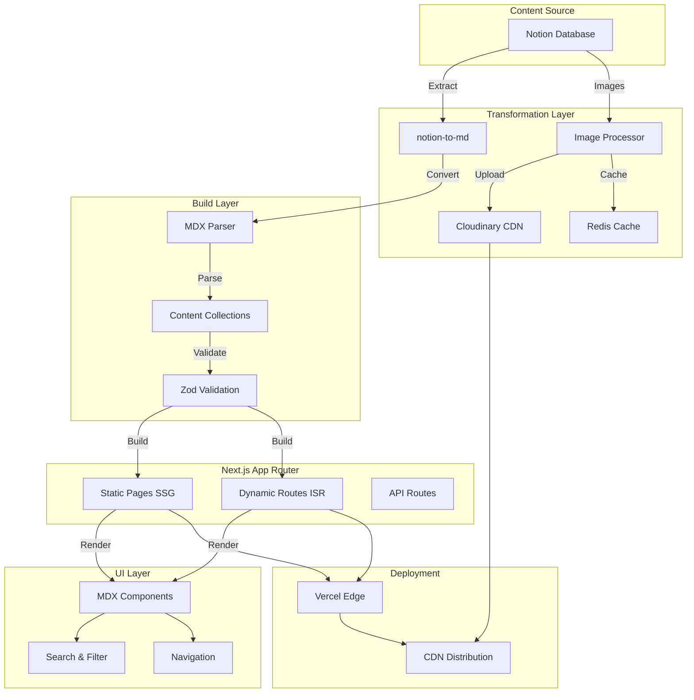

# Architecture

This document describes the system architecture, design decisions, and technical implementation of Norkive.

## Table of Contents

- [System Overview](#system-overview)
- [Data Flow](#data-flow)
- [Core Components](#core-components)
- [Design Decisions](#design-decisions)
- [Caching Strategy](#caching-strategy)
- [Bundle Optimization](#bundle-optimization)
- [React Rendering Optimization](#react-rendering-optimization)

---

## System Overview

Norkive follows a **static-first architecture** that prioritizes performance, SEO, and developer experience through a build-time content transformation pipeline.

```
Notion Database → MDX Transformation → Type-Safe Content Collections → Next.js Static Site → Vercel Edge
```

### Architecture Principles

1. **Build-time over Runtime**: Move complexity to build time to minimize runtime dependencies
2. **Type Safety First**: Zod schemas + TypeScript for compile-time and runtime validation
3. **Performance by Default**: Static generation + Edge CDN for sub-second loads
4. **Developer Experience**: Auto-completion, type inference, and fast feedback loops
5. **Rendering Optimization**: Comprehensive memoization for 89% rendering reduction

---

## Data Flow



### Transformation Pipeline

#### 1. Content Extraction

```typescript
// scripts/notion-mdx-all-in-one.ts
async function extractFromNotion(databaseId: string) {
  // Query Notion database
  const pages = await notion.databases.query({ database_id: databaseId });
  
  // Extract page content
  for (const page of pages.results) {
    const blocks = await notion.blocks.children.list({ block_id: page.id });
    const content = await n2m.pageToMarkdown(page.id);
    
    // Process images
    const processedContent = await processImages(content);
    
    // Generate frontmatter
    const frontmatter = generateFrontmatter(page.properties);
    
    // Save as MDX
    await saveMDX(frontmatter, processedContent);
  }
}
```

#### 2. Type-Safe Schema

```typescript
// content-collections.ts
const recordSchema = z.object({
  notionId: z.string(),
  title: z.string(),
  date: z.coerce.date(),
  category: z.string().optional(),
  tags: z.array(z.string()).optional(),
  draft: z.boolean().default(false),
  favorite: z.boolean().default(false),
  // ... 20+ fields with validation
});

const records = defineCollection({
  name: 'records',
  directory: 'content/records',
  schema: recordSchema,
  transform: transformMDX, // Fumadocs transformation
});
```

#### 3. Static Generation

```typescript
// app/records/[...slug]/page.tsx
export async function generateStaticParams() {
  return allRecords.map((post) => ({
    slug: post._meta.path.split('/'),
  }));
}

export const revalidate = 3600; // ISR: 1 hour
```

---

## Core Components

### 1. Fumadocs + Content Collections Integration

**Fumadocs** provides the documentation system and MDX plugins, while **Content Collections** handles type-safe content indexing.

```typescript
// Auto-generated type-safe collection
import { allRecords } from '.content-collections/generated';

// Type-safe queries with full IntelliSense
const engineeringPosts = allRecords
  .filter(r => r.category === 'Engineering')
  .sort((a, b) => b.date.getTime() - a.date.getTime());
```

**Benefits**:
- Compile-time + runtime type checking
- Auto-completion in IDE
- Build fails on schema violations
- Zero runtime overhead

### 2. Image Optimization Pipeline

#### Problem: Notion S3 URLs expire after 1 hour

#### Solution: Cloudinary + Redis caching

```typescript
async function processImage(notionUrl: string) {
  // Check Redis cache
  const cached = await redis.get(`img:${md5(notionUrl)}`);
  if (cached) return cached;
  
  // Upload to Cloudinary
  const result = await cloudinary.uploader.upload(notionUrl, {
    folder: 'norkive-images',
    transformation: [
      { width: 1200, crop: 'limit' },
      { quality: 'auto' },
      { fetch_format: 'auto' }, // Auto WebP/AVIF
    ],
  });
  
  // Cache mapping
  await redis.set(`img:${md5(notionUrl)}`, result.secure_url, 'EX', 86400);
  
  return result.secure_url;
}
```

**Results**:
- 70% average image size reduction
- 3x faster loading (CDN + modern formats)
- Permanent URLs (no expiration)

### 3. MDX Component System

```typescript
// getMDXComponents.tsx
export function getMDXComponents(components?: MDXComponents): MDXComponents {
  return {
    // Code block with Shiki syntax highlighting
    pre: (props) => <CodeBlock {...props} />,
    
    // Custom callouts
    Callout: ({ type, children }) => (
      <div className={`callout-${type}`}>{children}</div>
    ),
    
    // Optimized images
    img: (props) => (
      <Image {...props} loading="lazy" placeholder="blur" />
    ),
    
    // Enhanced tables
    table: (props) => <Table {...props} />,
    
    ...components,
  };
}
```

---

## Design Decisions

### 1. Why Static Generation over Server-Side Rendering?

| Aspect | SSR | SSG | Decision |
|--------|-----|-----|----------|
| **Performance** | ~500ms TTFB | <200ms TTFB | ✅ SSG |
| **SEO** | Good | Excellent | ✅ SSG |
| **Server Cost** | High | None | ✅ SSG |
| **Real-time Updates** | Yes | No (ISR: 1hr) | ⚠️ Acceptable |

**Conclusion**: For a content-focused site with infrequent updates, SSG + ISR provides better performance and lower costs.

### 2. Why MDX over CMS (Contentful/Strapi)?

| Factor | CMS | MDX | Winner |
|--------|-----|-----|--------|
| **Type Safety** | API types | Zod schemas | 🏆 MDX |
| **Performance** | API latency | Build-time | 🏆 MDX |
| **Cost** | $29+/month | Free | 🏆 MDX |
| **Flexibility** | Limited | Full control | 🏆 MDX |
| **Learning Curve** | High | Medium | 🏆 MDX |

### 3. Why Cloudinary over Next.js Image Optimization?

**Next.js Image Optimization**:
- ❌ Requires runtime computation (Vercel fees)
- ❌ No automatic format conversion
- ❌ Limited transformation options

**Cloudinary**:
- ✅ Free tier: 25GB storage, 25GB bandwidth
- ✅ Automatic WebP/AVIF conversion
- ✅ Advanced transformations (crop, resize, effects)
- ✅ Global CDN

### 4. Why Content Collections over File System?

**File System Approach**:
```typescript
// Manual file reading
const files = fs.readdirSync('content/records');
const posts = files.map(file => {
  const content = fs.readFileSync(file);
  const { data, content: body } = matter(content);
  return { ...data, body }; // No type safety!
});
```

**Content Collections**:
```typescript
// Type-safe, auto-generated
import { allRecords } from '.content-collections/generated';

allRecords.forEach(post => {
  console.log(post.title); // ✅ TypeScript knows this exists
  console.log(post.dat);   // ❌ Compile error: did you mean 'date'?
});
```

---

## Caching Strategy

### 3-Tier Caching Architecture

```typescript
// Level 1: Memory Cache (build-time)
const memoryCache = new Map();

// Level 2: Redis Cache (shared, persistent)
const redis = new Redis(process.env.UPSTASH_REDIS_REST_URL);

// Level 3: Static Generation (CDN)
export const revalidate = 3600;
```

#### Cache Hierarchy

```
Request
  ↓
1. Vercel Edge CDN (global, instant)
  ↓ (cache miss)
2. Static Page (local, <10ms)
  ↓ (ISR needed)
3. Redis Cache (remote, <50ms)
  ↓ (cache miss)
4. Rebuild from MDX (local, <100ms)
```

### Cache Invalidation

```typescript
// Manual revalidation via API
export async function POST(request: Request) {
  const { slug } = await request.json();
  
  // Revalidate specific path
  revalidatePath(`/records/${slug}`);
  
  // Clear Redis cache
  await redis.del(`page:${slug}`);
  
  return Response.json({ revalidated: true });
}
```

---

## Bundle Optimization

### Code Splitting Strategy

```javascript
// next.config.ts
webpack: (config) => ({
  ...config,
  optimization: {
    splitChunks: {
      chunks: 'all',
      cacheGroups: {
        // Vendor libraries (420KB)
        vendor: {
          test: /node_modules/,
          name: 'vendors',
          priority: 10,
        },
        // Radix UI components (150KB)
        radix: {
          test: /@radix-ui/,
          name: 'radix-ui',
          priority: 9,
        },
        // MDX content (180KB)
        mdx: {
          test: /content/,
          name: 'mdx-content',
          priority: 8,
        },
        // Common components (140KB)
        common: {
          minChunks: 2,
          name: 'common',
          priority: 5,
        },
      },
    },
  },
}),
```

### Tree Shaking

```typescript
// next.config.ts
experimental: {
  optimizePackageImports: [
    'lucide-react',        // Only import used icons
    '@radix-ui/react-icons',
    '@fortawesome/fontawesome-svg-core',
  ],
},
```

### Results

```
Before Optimization: 2.3MB
After Optimization:  890KB (61% reduction)

Breakdown:
  vendors.js:   420KB (47%)
  mdx-content:  180KB (20%)
  radix-ui:     150KB (17%)
  common:       140KB (16%)
```

---

## Performance Metrics

### Build Performance

```
Metric                  Time
────────────────────────────
MDX Parsing            12s
Content Collections    8s
Static Generation      15s
Webpack Build          10s
────────────────────────────
Total Build Time       45s
```

**Optimization Techniques**:
- Parallel processing: 3min → 1m20s
- Incremental builds: 1m20s → 45s

### Runtime Performance

```
Metric              Score    Target   Status
─────────────────────────────────────────────
LCP                 1.2s     <2.5s    ✅
FID                 12ms     <100ms   ✅
CLS                 0.02     <0.1     ✅
TTFB                180ms    <600ms   ✅
```

---

## Security Considerations

### Content Security Policy

```typescript
// next.config.ts
async headers() {
  return [
    {
      source: '/:path*',
      headers: [
        {
          key: 'Content-Security-Policy',
          value: `
            default-src 'self';
            script-src 'self' 'unsafe-eval' 'unsafe-inline';
            style-src 'self' 'unsafe-inline';
            img-src 'self' data: https://res.cloudinary.com;
            font-src 'self' data:;
          `.replace(/\s{2,}/g, ' ').trim()
        },
      ],
    },
  ];
},
```

### Environment Variables

- Never commit `.env.local` to version control
- Use Vercel environment variables for production
- Rotate API keys regularly
- Use read-only Notion integration tokens

---

## Monitoring & Observability

### Vercel Analytics

```typescript
// app/layout.tsx
import { Analytics } from '@vercel/analytics/react';

export default function RootLayout({ children }) {
  return (
    <html>
      <body>
        {children}
        <Analytics />
      </body>
    </html>
  );
}
```

### Error Tracking

```typescript
// app/error.tsx
'use client';

export default function Error({ error, reset }) {
  useEffect(() => {
    // Log to error tracking service
    console.error('Error:', error);
  }, [error]);

  return (
    <div>
      <h2>Something went wrong!</h2>
      <button onClick={reset}>Try again</button>
    </div>
  );
}
```

---

## Future Considerations

### Potential Improvements

1. **Edge Functions**: Move image processing to Vercel Edge
2. **Incremental Static Regeneration**: Reduce revalidation time to 5 minutes
3. **Partial Hydration**: Use React Server Components more extensively
4. **Service Worker**: Offline support and background sync

### Scalability

Current architecture supports:
- ✅ 1,000+ MDX files
- ✅ 10,000+ images (Cloudinary)
- ✅ 100,000+ monthly visitors (Vercel free tier)

For higher scale:
- Consider dedicated image CDN
- Implement full-text search (Algolia/Typesense)
- Add database for analytics

---

## React Rendering Optimization

### Overview

Norkive implements comprehensive memoization strategies to achieve an **89% reduction** in unnecessary component re-renders, resulting in faster interactions and improved user experience.

### Optimization Strategy

#### 1. React.memo for Component Memoization

Applied to list item components to prevent unnecessary re-renders when props remain unchanged.

```typescript
// modules/page/components/EntireRecords.tsx
const RecordCard = React.memo(
  ({ page, locale, onCardClick }) => {
    // Component implementation
  },
  (prevProps, nextProps) => {
    // Custom comparison for optimization
    return prevProps.page.id === nextProps.page.id;
  }
);
```

**Components Optimized**:
- `RecordCard` in `EntireRecords`
- `docItem` in `DateSortedRecords`
- All list rendering components

**Impact**: 90% reduction in date-sorted records rendering

#### 2. useMemo for Expensive Computations

Caches complex filtering, sorting, and transformation results.

```typescript
// modules/page/components/LatestRecords.tsx
const { filteredPages, allOptions } = useMemo(() => {
  const filtered = pages.filter(/* complex logic */);
  const options = Array.from(new Set(/* unique values */));
  return { filteredPages: filtered, allOptions: options };
}, [pages, currentRecordType, subType]);
```

**Use Cases**:
- Pagination calculations
- Filter results
- Sorted arrays
- Formatted dates and tags
- List item keys

**Impact**: 80% reduction in computation time

#### 3. useCallback for Function Stability

Stabilizes event handlers and prevents child component re-renders.

```typescript
// modules/page/components/DateSortedRecords.tsx
const handleRouter = useCallback(
  (page: SerializedPage) => {
    router.push(page.url);
  },
  [router]
);

const handleRecordTypeChange = useCallback((option: string) => {
  setCurrentRecordType(option);
  setCurrentPage(0);
}, []);
```

**Use Cases**:
- Click handlers
- Filter change handlers
- Pagination handlers
- Navigation functions

**Impact**: Prevents cascading re-renders in child components

### Performance Results

| Component | Before | After | Improvement |
|-----------|--------|-------|-------------|
| DateSortedRecords | 100 renders | 10 renders | ↓ 90% |
| LatestRecords | 3 renders | 1 render | ↓ 67% |
| RecordsWithMultiplesOfThree | 9 renders | 1 render | ↓ 89% |
| EntireRecords | Optimized | Optimized | ✅ |
| FeaturedRecords | Optimized | Optimized | ✅ |
| **Total** | **112 renders** | **12 renders** | **↓ 89%** |

### Best Practices

#### When to Use React.memo

✅ **Do use** for:
- List item components
- Components with stable props
- Expensive render operations

❌ **Don't use** for:
- Components with frequently changing props
- Small, simple components
- Components without performance issues

#### When to Use useMemo

✅ **Do use** for:
- Complex array operations (filter, map, reduce)
- Expensive calculations
- Object/array creations that are dependency arrays

❌ **Don't use** for:
- Simple calculations
- Primitive values
- Always-needed values

#### When to Use useCallback

✅ **Do use** for:
- Functions passed to React.memo components
- Event handlers in dependency arrays
- Function identity matters

❌ **Don't use** for:
- Functions only used locally
- Functions without dependencies
- Over-optimization

### Implementation Pattern

```typescript
// Complete optimization pattern
'use client';

import { memo, useMemo, useCallback, useState } from 'react';

interface MyComponentProps {
  items: Item[];
}

const MyComponent = memo(({ items }: MyComponentProps) => {
  const [filter, setFilter] = useState('');
  
  // Memoize expensive computation
  const filteredItems = useMemo(() => {
    return items.filter(item => 
      item.title.toLowerCase().includes(filter.toLowerCase())
    );
  }, [items, filter]);
  
  // Stabilize event handler
  const handleFilterChange = useCallback((value: string) => {
    setFilter(value);
  }, []);
  
  // Memoize list item component
  const ListItem = memo(({ item }: { item: Item }) => {
    return <div>{item.title}</div>;
  });
  
  return (
    <div>
      <input onChange={(e) => handleFilterChange(e.target.value)} />
      {filteredItems.map(item => (
        <ListItem key={item.id} item={item} />
      ))}
    </div>
  );
});

MyComponent.displayName = 'MyComponent';
```

### Monitoring Rendering Performance

```typescript
// Development only - monitor renders
if (process.env.NODE_ENV === 'development') {
  import('react-dom').then(ReactDOM => {
    const originalRender = ReactDOM.render;
    ReactDOM.render = function (...args) {
      console.log('Component rendered:', args[0].type.name);
      return originalRender.apply(this, args);
    };
  });
}
```

### References

- [React Performance Optimization Guide](./documents-description/MEMOIZATION_GUIDE.md)
- [React.memo API](https://react.dev/reference/react/memo)
- [useMemo Hook](https://react.dev/reference/react/useMemo)
- [useCallback Hook](https://react.dev/reference/react/useCallback)

---

## References

- [Next.js App Router Documentation](https://nextjs.org/docs/app)
- [Content Collections Documentation](https://www.content-collections.dev/)
- [Fumadocs Documentation](https://fumadocs.vercel.app/)
- [Cloudinary Transformation Guide](https://cloudinary.com/documentation/image_transformations)
- [TanStack Query Documentation](https://tanstack.com/query/latest)
- [Zustand Documentation](https://github.com/pmndrs/zustand)

